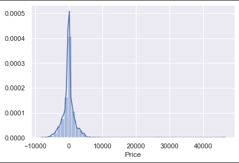

# AI | ML | NLP | Data Science

## Education
- Bachelor of Technology, Computer Science|NIIT University|*2024*
- Class 12 (PCM)|Stepping Stones Senior Secondary School, Chandigarh|*2020*
- Class 10|Vivek High School, Mohali|*2018*
 

## Projects

### Simulation of Spread of Epidemics
- Developed and implemented an agent-based model working on a heterogenous population.
- Overcame the loopholes from the existing solutions.
- [Link to repository](https://github.com/parthdacoder/Simulation_Of_Epidemic_Using_Agent-Based-Model/tree/main)
- Below are some graphs that visualise the predictions made by our model:

*Comparison w.r.t. Population Density*

### Fake News Detection
- Applied TF-IDF vectorization in addition to other NLP techniques such as stemming, lemmatization, tokenization.
- [Link to repository](https://github.com/khushisharma31/FakeNewsDetection)

*Simple UI*

### Flight Fares Prediction
- Employed Exploratory Data Analysis (EDA) techniques to extract insights for model enhancement. 
- Employed feature selection methods including heatmap analysis and SelectKBest.
- [Link to repository](https://github.com/parthdacoder/Simulation_Of_Epidemic_Using_Agent-Based-Model/tree/main)

*Source VS Price*
  

---
## Work Experience

<figure style="float: left; margin-right: 10px;">
    
</figure>

### GenerativeAI and Data Science @ Thoucentric
*Jan 2024 - Present*

- Automated the selection process for the top models based on concluded metrics from 51 (ML and Classical Time-Series) models per commodity, enhancing our in-house commodity price forecasting product.
- Innovated a full stack proof-of-concept multi-agent system utilizing GenAI for a multinational FMCG firm. Enabled natural language queries to SQL conversion, and information retrieval from databases and PDFs using CrewAI, Langchain, Llama Index, and GPT-3.5 Turbo.
- Engineered an IT support bot for resolving L1 queries using Langchain and a commercial LLM, improving support efficiency for a leading FMCG company.
- Developed a generative AI-driven corporate bot for MS Teams to handle employee queries with an admin dashboard. Managed full stack development using Langchain, Teams Toolkit (JavaScript), Bot Framework SDK, Fast API, Python, and GPT-3.5 Turbo, ensuring optimized employee experience and engaging user interactions.
- Tackled real-life problem statements, utilizing Generative AI to devise innovative solutions for business challenges.

<figure style="float: left; margin-right: 10px;">
    
</figure>

### NLP/ML Intern @ NuacemAI
*Apr 2023 - Aug 2023*

- Led multilingual and custom Named Entity Recognition, enabling precise entity identification across languages. 
- Enhanced Semantic Textual Similarity (STS) model through API-driven implementation.
- Developed an image similarity project involving accurate pairwise face comparisons and result management.
- Conducted in-depth analysis on cutting-edge Large Language Models (LLMs), presenting influential findings.

<figure style="float: left; margin-right: 10px;">
    
</figure>

### Junior ML Engineer @ Omdena Community
*Apr 2023 - Present*
- Collaborated as a contributor in the project ”Natural Language Processing for Ethiopian Languages” for Addis Ababa, Ethiopia Chapter 
- Part of the data pre-processing team

<figure style="float: left; margin-right: 10px;">
    
</figure>

### Associate Program Manager @ Coding Ninjas
*Jun 2021 - Apr 2023*
- Supervised a three-tiered team to ensure timely project completion in an agile setup.
- Automated plagiarism and readability checks for 1000+ monthly blogs via Python-based API integrations.
- Analyzed data to optimize content strategies, enhance engagement, and managed centralized project database using ClickUp.

<figure style="float: left; margin-right: 10px;">
    
</figure>

### Technical Content Writer @ Coding Ninjas 
*Jan 2021 - Jun 2021*
- Authored over 20 articles on technical topics to simplify complex topic.
- [Link to blogs written](https://linktr.ee/khushisharma31)

<figure style="float: left; margin-right: 10px;">
    
</figure>

### Java Developer Intern @ Spice Money 
*Jun 2022 - Aug 2022*
- Strengthened Core Java skills with practical projects, gaining practice in RESTful API creation and maintenance.
- Proficient in SpringBoot, Spring, and Java Web Development.

<figure style="float: left; margin-right: 10px;">
    
</figure>

### Teaching Assistant @ NIIT University
*Feb 2021 - Jul 2021*

- Established industry-linked Project Banks for students of engineering to broaden their focus on real-world
applications.
- Mentored by Prof. Vijay V. Mandke, Assistant Professor at NIIT University.

---

## Technical Skills
- Languages|Python, Java, JavaScript, HTML/CSS, SQL, PL/SQL|
- Frameworks/Tools|Flask, Spring, SpringBoot, Git, Docker|
- Libraries|NumPy, Pandas, OpenCV, NLTK, SpaCy, Torch, Scikit, TensorFlow|

---

## Certifications
- Machine Learning by AndrewNg - Coursera (Ongoing) 
- SpringBoot - Udemy (June 2022) — [Link to certificate](https://www.udemy.com/certificate/UC-8dba34a7-bf52-42c6-a910-7f771463d2e4/)
